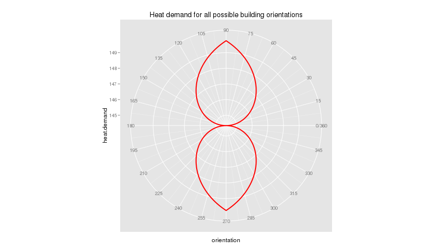

EnergyCalculatoR
================

The Energy Calculator consist of a single small scrip written in the R language,
which provides a function that accepts a range or parameters.
The script has to be run in order to make the function accessible.
We can run the script via::

  source("./Energy_Calculator.r")

That means that the file 'Energy_Calculator.r' has to be on the working path of the main script.
You could alternatively give an absolute path to the command, e.g::

  source("~/r/func/Energy_Calculator.r")

see the folder *./Examples* for some simple examples on how to use this function.

Some Examples:
--------------

1) Computing the monthly heat demand of a building.

   The following code shows a minimal example on how to
   compute the monthly heat demand of the *base* building::

           source("./Energy_Calculator.r")

           temp.1 <- Energy_Calculator(Building.Orientation = 0,
                                       Output.Type = "Month")
           Qhm <- temp.1$Qhm
           barplot(Qhm)

   Notice the parameter `Output.Type = "Month"`. The default value of this
   parameter is `Output.Type = "Year"`. The default is set to `Year`

2) Computing the heat demand for a set of buildings.

   In this example we change some parameters iteratively and store them in a variable.
   This example show the heat demand variation for different
   U- values combinations::

        source("./Energy_Calculator.r")

        Buildings.Number <- 9
        U.Values <- matrix(c(
          1.3,  1.0,	3.0,    # 01
          1.2,	0.9,	2.7,    # 02
          1.1,	0.8,	2.7,    # 03
          1.0,	0.7,	2.7,    # 04
          0.9,	0.6,	2.4,    # 05
          0.8,	0.5,	2.1,    # 06
          0.6,	0.4,	1.9,    # 07
          0.5,	0.3,	1.6,    # 08
          0.4,	0.2,	1.6),   # 09
          3,Buildings.Number)

        Heat.Demand <- rep(0,Buildings.Number)
        for (i in 1:Buildings.Number){
          UvalW <- U.Values[1,i]
          UvalR <- U.Values[2,i]
          UvalWindow <- U.Values[3,i]
          temp.2 <- Energy_Calculator(Building.UvalW = UvalW,
                                      Building.UvalR = UvalR,
                                      Building.UvalWindow = UvalWindow)
          Heat.Demand[i] <- temp.2$Qhs
        }

        barplot(Heat.Demand)

.. image:: Examples/Uval.png

3) Computing the effect of building orientation.

   For a given building dimensions we want to compute the
   heat demand for all possible orientations, and plot the result in
   a polar plane. For the plot we use the `ggplot2` library::

        library(ggplot2)
        source("./Energy_Calculator.r")

        iter <- seq(0,360,1)
        Heat.Demand = rep(0,length(iter))

        for (i in 1:length(iter)){
          BO <- iter[i]
          temp.2 <- Energy_Calculator(Building.Orientation = BO)
          Heat.Demand[i] <- temp.2$Qhs
        }

        result <- data.frame(heat.demand = Heat.Demand,
                             orientation = iter)
        doh <- ggplot(result, aes(orientation, heat.demand))
        doh + geom_line(colour = "red", size = 1)  +
          coord_polar(direction = -1, start = -pi/2) +
          labs(title = "Heat demand for all posible building orientations") +
          scale_x_continuous(breaks=seq(0, 360, 15))

